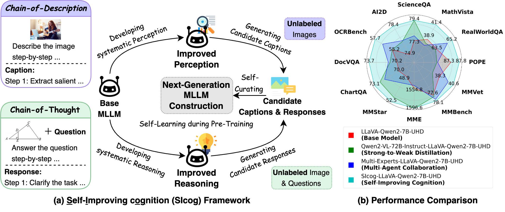

# Will Pre-Training Ever End?  
## A First Step Toward Next-Generation Foundation MLLMs via Self-Improving Systematic Cognition  

📄 [**arXiv:2503.12303**](https://arxiv.org/abs/2503.12303)  
📁 [Google Drive (Additional Resources, e.g., Paper, Training Data, Model Checkpoints)](https://drive.google.com/drive/folders/1IAmh7eCErl5fIXffXBC-B9GkXrEySMqc?usp=drive_link)

---



---

## 🧠 Abstract

Recent progress in (multimodal) large language models ((M)LLMs) has shifted focus from pre-training to inference-time compute scaling and post-training optimization, driven by concerns over limited high-quality real-world data. However, these strategies alone are insufficient for advancing model capabilities.

We hypothesize that **effective model improvement requires a strong synergy among pre-training, inference-time compute scaling, and post-training optimization**.

In this paper, we validate this hypothesis in the context of multimodal pre-training for foundation MLLM construction. We introduce **Self-Improving Cognition (SICOG)**, a self-learning framework for constructing next-generation foundation MLLMs by imparting multimodal knowledge and enhancing their systematic cognitive capabilities through multimodal pre-training with self-generated data.

Specifically, we introduce **Chain-of-Description (CoD)**, a step-by-step visual understanding method to improve comprehensive perception, and integrate structured **chain-of-thought (CoT)** reasoning to support in-depth multimodal reasoning.

SICOG first equips a base model with systematic perception and reasoning using minimal external supervision. The enhanced model then generates candidate image captions and CoT-style reasoning responses for *unlabeled images and image-question pairs across diverse tasks*, which are curated through a self-consistency mechanism.

These curated samples are subsequently used for large-scale multimodal pre-training, completing a self-learning cycle that strengthens the model’s cognitive foundation.

Extensive experiments demonstrate that SICOG produces next-generation foundation MLLMs with substantially improved multimodal cognition, outperforming prevailing pre-training approaches. These findings empirically establish SICOG as a promising framework for realizing a complete self-improving paradigm.

# Environment Setup

### Step 1: Python Environment Setup
To replicate the results, initialize the Python environment with the following commands:

```bash
conda create -n SICOG python=3.10
conda activate SICOG

pip install imgaug
pip install openpyxl

pip install --upgrade pip  # enable PEP 660 support
pip install torch==2.1.2
pip install -e .

pip install -e ".[train]"
pip install flash-attn --no-build-isolation
```

### Step 2: Download Checkpoints

Download the following checkpoints and place them in the /model_weight/ directory:
 [CLIP-ViT-L/14-336](https://huggingface.co/openai/clip-vit-large-patch14-336),
 [Qwen2-7B-Instruct](https://huggingface.co/Qwen/Qwen2-7B-Instruct). 

# CoD and CoT Training Data Generation

**Caption Data Generation**

Navigate to the ./training_data_annotation directory and download the Allava-VFLAN 35k split:

```bash
export ORIGINAL_CAPTION_FILE={path_to_original_caption_data}
export IMAGE_DIR={path_to_corresponding_images}
export OUTPUT_COD_DIR={path_to_cod_data}
export OUTPUT_DD_DIR={path_to_dd_data}
bash revise_cod.sh
```
Mix the generated caption data to create the 35k_annotated_caption_data.

**Reasoning Data Generation**

Download the LLAVA-CoT 35k split and replace tags with corresponding sentences:

```bash
export ORIGINAL_COT_FILE={path_to_original_reasoning_data}
export OUTPUT_COT_DIR={path_to_revised_cot_data}
export OUTPUT_SHORT_DIR={path_to_revised_short_answer_data}
bash revise_cot.sh
```
Combine the generated reasoning data to create the 35k_annotated_reasoning_data.

# Training Scripts for SICOG

Experiments were conducted on 4×8 NVIDIA A100 80GB GPUs.

1. **Developing Systematic Multimodal Cognition With Minimal Annotations** 

**Multimodal Perception Development**

```bash
export FINETUNE_LEARNING_RATE=2e-5
export FINETUNE_BATCH=4
export ACCU_STEPS=1
export PREV_STAGE_CHECKPOINT={base_model_checkpoint}
export EXPERIMENT_NAME={stage0_ckpt_perception}
export DATA_PATH={path_to_annotated_caption_data}

# Stage 0: Warmup for Perception Ability
bash training_scripts/uhdv1-finetune-qwen-stage0-warmup.sh
```

**Multimodal Reasoning Development**
```bash
export FINETUNE_LEARNING_RATE=2e-5
export FINETUNE_BATCH=4
export ACCU_STEPS=1
export PREV_STAGE_CHECKPOINT={base_model_checkpoint}
export EXPERIMENT_NAME={stage0_ckpt_reasoning}
export DATA_PATH={path_to_annotated_reasoning_data}

# Stage 0: Warmup for Reasoning Ability
bash training_scripts/uhdv1-finetune-qwen-stage0-warmup.sh
```

2. **Generating Candidate Captions and Responses for Pre-Training Data** <br>
Please refer to ```./recap_scripts``` for recap script (we comment in the file). <br>
<strong>Caption:</strong> You can change the type of prompt; 'cod-default' will ask the model to describe the image step-by-step, while 'default' will request the model to provide a detailed caption directly.<br>

```bash
export EXPERIMENT_NAME={recaption_job_cod}
export MODEL_PATH={stage0_ckpt_perception}
export DATA_PATH={unlabeled_image_data_path}
# Change the parameters to generate multiple Candidates
export TEMPERATURE=0.7
export BEAMS=1
export TOP_P=0.9
export PROMPT="cod-default"  # Step-by-step description
bash recap_scripts/recap_inference.sh
```

```bash
export EXPERIMENT_NAME={recaption_job_default}
export PROMPT="default"  # Detailed description
bash recap_scripts/recap_inference.sh
```

<strong>Reasoning:</strong> You can change the type of prompt; 'cot-default' will ask the model to answer the question step-by-step, while 'default' will request the model to directly answer.

```bash
export EXPERIMENT_NAME={reasoning_job_cot}
export MODEL_PATH={stage0_ckpt_reasoning}
export DATA_PATH={unlabeled_image_question_pair_data_path}
export SPLIT={data_split}
export TEMPERATURE=0.7
export BEAMS=1
export TOP_P=0.9
export PROMPT="cot-default"  # Step-by-step reasoning
bash recap_scripts/reasoning_inference.sh
```

```bash
export EXPERIMENT_NAME={reasoning_job_default}
export PROMPT="default"  # Direct answer
bash recap_scripts/reasoning_inference.sh
```

3. **Curating Self-Generated Pre-Training Data via Self-Consistency-Guided Quality Evaluation**


```bash
# Caption Quality Evaluation
export RAW_DATASET={path_to_generated_caption_data}
export MODEL_NAME_OR_PATH={stage0_ckpt_perception}
bash quality_evaluation/scripts/recaption_quality_eval.sh
```

```bash
# Reasoning Quality Evaluation
export RAW_DATASET={path_to_generated_reasoning_data}
export MODEL_NAME_OR_PATH={stage0_ckpt_reasoning}
bash quality_evaluation/scripts/reasoning_quality_eval.sh
```

Combine the filtered caption and reasoning data to create self_generated_pre_training_data.

4. **Constructing the Next-Generation MLLM Through Multimodal Pre-Training**:<br>
Please refer to ```./training_scripts``` for pretraining script and fine-tuning script (we comment in the file). Here is an example attached below. <br>
Please ensure that the total batch size during the alignment phase is 256, and the total batch size during the fine-tuning phase is 128. <br>

```bash
export PRETRAIN_LEARNING_RATE=2e-4
export FINETUNE_LEARNING_RATE=2e-5
export PRETRAIN_BATCH=8
export FINETUNE_BATCH=4
export ACCU_STEPS=2
```

```bash
export EXPERIMENT_NAME={stage1-align}
export DATA_PATH={path_to_alignment_data}
# stage1 Modality Alignment
bash training_scripts/uhdv1-pretrain-qwen-stage1-align.sh
```

```bash
export EXPERIMENT_NAME={stage15-multimodal pre-training}
export DATA_PATH={path_to_self_generated_pre_training_data}
export MM_PROJECTOR_CHECKPOINT={stage1-mm-projector-checkpoint}
export LLM_CKPT_DIR={Qwen-checkpoint}
# stage15 Self-learning via Multimodal Pre-Training
bash training_scritps/uhdv1-finetune-qwen-stage15-sft.sh
```

```bash
export EXPERIMENT_NAME={stage2-sft}
export DATA_PATH={path_to_instruction_tuning_data}
export PREV_STAGE_CHECKPOINT={stage15_checkpoint}
# stage2 Visual Instruction-Tuning
bash training_scritps/uhdv1-finetune-qwen-stage2-sft.sh
```

To reproduce DPO variants for systematic cognition development, you can use the following example script to generate noisy reasoning data.

```bash
export EXPERIMENT_NAME={noisy_reasoning_generation}
export MODEL_PATH={stage0_ckpt_reasoning}
export DATA_PATH={unlabeled_image_question_pair_data_path}
export SPLIT={data_split}
export AUGMENT_METHODS={method_to_corrupt_image}  # e.g., "gaussian_blur", "color_jitter", etc.
export TEMPERATURE=0.7
export BEAMS=1
export TOP_P=0.9
export PROMPT="cot-default"  # Step-by-step reasoning
bash recap_scripts/reasoning_inference.sh
```

If any problem occurs, you can still refer to the [LLaVA-UHD](https://github.com/thunlp/LLaVA-UHD) repository to seek solutions.

## Evaluation
**VLMEvalKit**: 
We use [VLMEvalKit](https://github.com/open-compass/VLMEvalKit) to evaluete the performance of our model on the general benchmark. You can follow the setup instruction of [VLMEvalKit](https://github.com/open-compass/VLMEvalKit) to evaluate.

## Acknowledgement

- Thanks the contributors of The LLaVA-NeXT project (listed alphabetically by the first names): [Bo Li](https://brianboli.com/), [Dong Guo](https://www.linkedin.com/in/dongguoset/), [Feng Li](https://scholar.google.com/citations?hl=zh-CN&user=ybRe9GcAAAAJ&view_op=list_works&sortby=pubdate), [Hao Zhang](https://scholar.google.com/citations?user=B8hPxMQAAAAJ&hl=en), [Kaichen Zhang](https://www.linkedin.com/in/kaichen-zhang-014b17219/?originalSubdomain=sg), [Renrui Zhang](https://zrrskywalker.github.io/), [Yuanhan Zhang](https://zhangyuanhan-ai.github.io/), led by [Chunyuan Li](https://chunyuan.li/) and with the guidance and help from [Haotian Liu](https://hliu.cc/).

## Citation
If you find SICOG useful for your research and applications, please cite using this BibTeX:
```bibtex
@article{zhang2025will,
  title={Will Pre-Training Ever End? A First Step Toward Next-Generation Foundation MLLMs via Self-Improving Systematic Cognition},
  author={Zhang, Xiaoying and Peng, Da and Zhang, Yipeng and Guo, Zonghao and Wu, Chengyue and Chen, Chi and Ke, Wei and Meng, Helen and Sun, Maosong},
  journal={arXiv e-prints},
  pages={arXiv--2503},
  year={2025}
}
```
