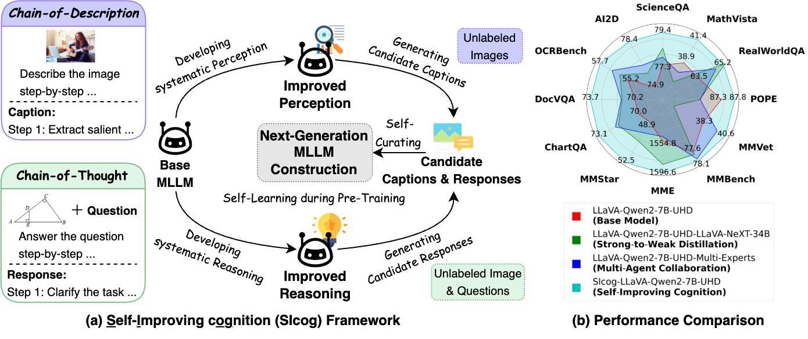

# Will Pre-Training Ever End?  
## A First Step Toward Next-Generation Foundation MLLMs via Self-Improving Systematic Cognition  

📄 [**arXiv:2503.12303**](https://arxiv.org/abs/2503.12303)  
📁 [Google Drive (Additional Resources, e.g., Paper, Training Data, Model Checkpoints)](https://drive.google.com/drive/folders/1IAmh7eCErl5fIXffXBC-B9GkXrEySMqc?usp=drive_link)

---



---

## 🧠 Abstract

Recent progress in (multimodal) large language models ((M)LLMs) has shifted focus from pre-training to inference-time compute scaling and post-training optimization, driven by concerns over limited high-quality real-world data. However, these strategies alone are insufficient for advancing model capabilities.

We hypothesize that **effective model improvement requires a strong synergy among pre-training, inference-time compute scaling, and post-training optimization**.

In this paper, we validate this hypothesis in the context of multimodal pre-training for foundation MLLM construction. We introduce **Self-Improving Cognition (SICOG)**, a self-learning framework for constructing next-generation foundation MLLMs by imparting multimodal knowledge and enhancing their systematic cognitive capabilities through multimodal pre-training with self-generated data.

Specifically, we introduce **Chain-of-Description (CoD)**, a step-by-step visual understanding method to improve comprehensive perception, and integrate structured **chain-of-thought (CoT)** reasoning to support in-depth multimodal reasoning.

SICOG first equips a base model with systematic perception and reasoning using minimal external supervision. The enhanced model then generates candidate image captions and CoT-style reasoning responses for *unlabeled images and image-question pairs across diverse tasks*, which are curated through a self-consistency mechanism.

These curated samples are subsequently used for large-scale multimodal pre-training, completing a self-learning cycle that strengthens the model’s cognitive foundation.

Extensive experiments demonstrate that SICOG produces next-generation foundation MLLMs with substantially improved multimodal cognition, outperforming prevailing pre-training approaches. These findings empirically establish SICOG as a promising framework for realizing a complete self-improving paradigm.


```bibtex
@article{zhang2025will,
  title={Will Pre-Training Ever End? A First Step Toward Next-Generation Foundation MLLMs via Self-Improving Systematic Cognition},
  author={Zhang, Xiaoying and Peng, Da and Zhang, Yipeng and Guo, Zonghao and Wu, Chengyue and Chen, Chi and Ke, Wei and Meng, Helen and Sun, Maosong},
  journal={arXiv e-prints},
  pages={arXiv--2503},
  year={2025}
}
