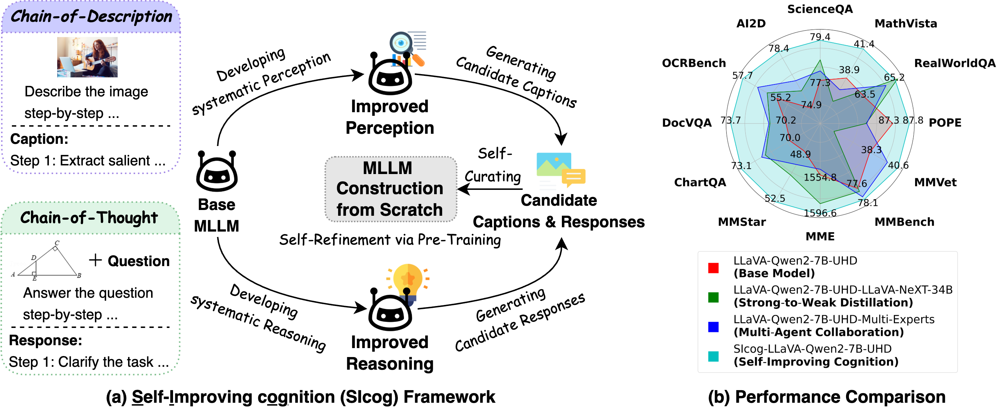

# SIcog 
**Towards Self-Improving Systematic Cognition for Next-Generation Foundation MLLMs**  
(https://arxiv.org/abs/2503.12303)

## Abstract  
Despite their impressive capabilities, **Multimodal Large Language Models (MLLMs)** face challenges with fine-grained perception and complex reasoning. Prevalent multimodal pre-training approaches focus on enhancing perception by training on high-quality image captions, as collecting **chain-of-thought (CoT) reasoning** data is prohibitively expensive. While leveraging advanced MLLMs for caption generation improves scalability, the generated outputs often lack comprehensiveness and accuracy. In this paper, we introduce **Self-Improving cognition (SIcog)**, a self-learning framework designed to construct next-generation foundation MLLMs by enhancing their systematic cognitive capabilities through multimodal pre-training with self-generated data. Specifically, we propose **Chain-of-Description**, an approach that improves an MLLM’s systematic perception by enabling step-by-step visual understanding, ensuring greater comprehensiveness and accuracy. Additionally, we adopt a structured **CoT reasoning** technique to enable MLLMs to integrate in-depth multimodal reasoning. To construct a next-generation foundation MLLM with self-improved cognition, **SIcog** first equips an MLLM with systematic perception and reasoning abilities using minimal external annotations. The enhanced models then generate detailed captions and CoT reasoning data, which are further curated through self-consistency. This curated data is ultimately used for multimodal pre-training to develop next-generation foundation models. Extensive experiments on both low- and high-resolution MLLMs across diverse benchmarks demonstrate that, with only **213K self-generated pre-training samples**, **SIcog** produces next-generation foundation MLLMs with significantly improved cognition, achieving **benchmark-leading performance** compared to prevalent pre-training approaches.
